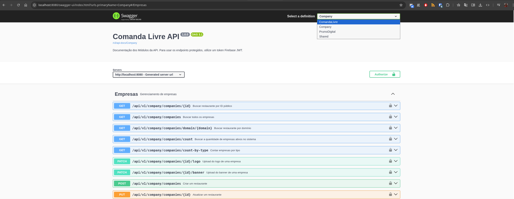
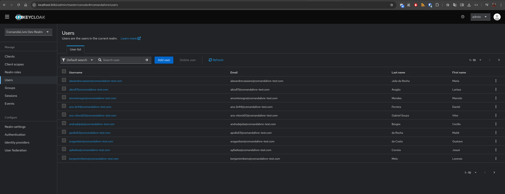
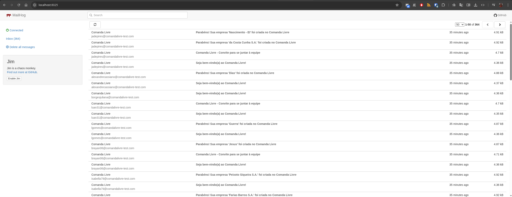
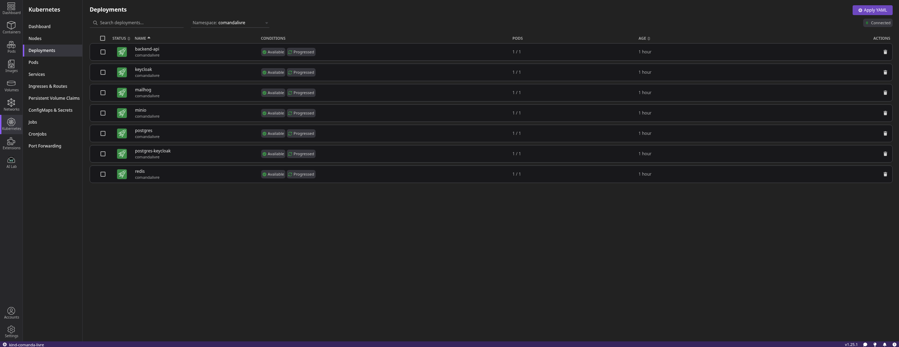
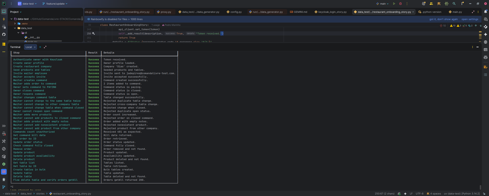

# Comanda Livre 🍽️

O **Comanda Livre** é um projeto para gerenciamento de comandas em restaurantes. Este repositório atua como meu **laboratório de engenharia**, onde aplico conceitos de arquitetura, escalabilidade e novas tecnologias conforme evoluo em minha jornada como desenvolvedor.

Atualmente, o projeto evoluiu de um **Monolito Modular** (Spring Modulith) para uma arquitetura de **Microsserviços** organizada em um **Monorepo**, orquestrada por **Kubernetes (K8s)** e automatizada via **Gradle Kotlin DSL**.

---

## 🏗️ Estrutura do Monorepo

O projeto está dividido em serviços independentes localizados na pasta `/services`:

* **comandalivre-service:** Gestão de comandas.
* **company-service:** Gestão de empresas e unidades.
* **user-service:** Gestão de usuários e permissões.
* **prumodigital-service:** Gestão de obras (outro aplicativo).

---

## 🚀 Estado Atual: Migração para Kubernetes

Nesta etapa inicial, o foco foi a migração completa dos recursos auxiliares e da API para um cluster local utilizando **Kind**. A infraestrutura foi organizada utilizando **Kustomize**, permitindo a separação entre definições base e customizações de ambiente.

### Componentes da Infraestrutura:

* **PostgreSQL:** Banco de dados principal e instância dedicada para o Keycloak.
* **Keycloak:** Gestão de identidade e acesso (IAM).
* **MinIO:** Storage de objetos compatível com S3 para fotos e documentos.
* **MailHog:** Servidor SMTP local para testes de envio de e-mail.
* **Redis Stack:** Cache distribuído e interface visual de monitoramento.

> **Nota de Performance:** Todos os manifestos possuem limites de recursos (`limits/requests`) configurados para testar o desempenho da aplicação operando em cenários de recursos reduzidos.

---

## 🛠️ Central de Automação (Engineering Lab)

Para eliminar o trabalho manual repetitivo, o `build.gradle.kts` na raiz do projeto atua como um orquestrador. Você pode gerenciar todo o ciclo de vida do ambiente local com os comandos abaixo:

### Comandos de Infraestrutura (Kind)

| Comando | Descrição |
| --- | --- |
| `./gradlew createCluster` | Cria o cluster Kind utilizando o `kind-config.yaml`. |
| `./gradlew deleteCluster` | Remove o cluster Kind `comanda-livre`. |
| `./gradlew printLabStatus` | Lista todos os serviços registrados e suas versões atuais. |

### Ciclo de Desenvolvimento e Deploy

| Comando | Descrição |
| --- | --- |
| `./gradlew buildImages` | Gera as imagens Docker para todos os serviços usando Buildpacks. |
| `./gradlew loadImagesToKind` | Builda e injeta as imagens nos nós do Kind (evita buscar no Docker Hub). |
| **`./gradlew deployDev`** | **O comando mestre.** Executa o build, carrega no Kind e aplica o Kustomize. |

---

## 📂 Organização do Projeto

```text
.
├── k8s
│   ├── base                   # Recursos base compartilhados
│   │   ├── apps               # Manifestos dos microsserviços
│   │   ├── auth               # Keycloak (IAM)
│   │   └── infra              # DB, Cache, Mail, Storage
│   ├── cluster                # Configuração do Cluster Kind
│   └── overlays/dev           # Customizações para ambiente local (Patches/Secrets)
├── services                   # Código fonte dos microsserviços (Kotlin/Spring Boot)
│   ├── comandalivre-service
│   ├── company-service
│   ├── user-service
│   └── prumodigital-service
└── build.gradle.kts           # Orquestrador de automação              

```

---

## 🌐 Onde acessar? (Ambiente Dev)

Graças ao mapeamento de portas configurado, os serviços são acessíveis diretamente via `localhost`:

| Serviço | URL Local | Porta Host |
| --- | --- | --- |
| **ComandaLivre Service** | `http://localhost:8080` | 8080 |
| **Company Service** | `http://localhost:8081` | 8081 |
| **User Service** | `http://localhost:8082` | 8082 |
| **PrumoDigital Service** | `http://localhost:8083` | 8083 |
| **Keycloak UI** | `http://localhost:8090` | 8090 |
| **MailHog Web** | `http://localhost:8025` | 8025 |
| **PostgreSQL** | `localhost:5432` | 5432 |

---

## 🖼️ Screenshots do Ambiente

| Swagger API | Keycloak Auth | MailHog (SMTP) | Podman | Ferramenta de Testes |
| --- | --- | --- | --- | --- |
|  |  |  |  |  |

---

## 🛤️ Próximos Passos

* [x] Orquestração de Infra: Subir todos os serviços de apoio (DB, Cache, Auth, Storage) no Kubernetes.s
* [x] Estrutura de Microsserviços: Criação dos skeletons dos projetos utilizando Spring Boot CLI e Kotlin DSL.
* [x] Automação de Engenharia: Ciclo total de Build, Load e Deploy local automatizado via Gradle.
* [ ] Gestão de Código: Publicação do código fonte inicial dos microsserviços no Monorepo.
* [ ] Mensageria: Implementar eventos assíncronos com Kafka para comunicação entre domínios.
* [ ] Comunicação Inter-serviços: Implementar chamadas síncronas utilizando gRPC ou Spring's HTTP Interface.
* [ ] API Gateway: Centralizar o roteamento e segurança das chamadas externas em um único ponto de entrada.
* [ ] Subir o codigo do Frontend Web/Mobile (Flutter).